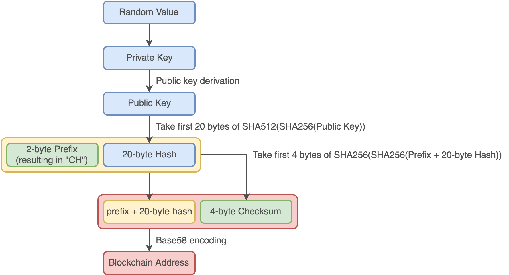

# Cryptography

## Private/Public Keys

Private/public key pairs are generated using Elliptic Curve Cryptography. Similar to other major blockchain projects, Own blockchain uses a specific Koblitz curve [secp256k1](https://en.bitcoin.it/wiki/Secp256k1).

Concrete implementation of algorithm used in Own blockchain comes from [secp256k1 library](https://github.com/bitcoin-core/secp256k1), which we use as wrapped in a [.NET wrapper library](https://github.com/MeadowSuite/Secp256k1.Net).

## Hashing

Own blockchain uses [SHA256](https://en.wikipedia.org/wiki/SHA-256) as the main hashing algorithm. Implementation of SHA256 is part of .NET standard library.

## Encoding

All cryptographic artifacts (private/public keys, hashes, etc.) are encoded as [Base58](https://en.wikipedia.org/wiki/Base58) strings and used as such throughout the application and external interfaces. Base58 dictionary used is the same as the one used in Bitcoin implementation.

Own blockchain uses the implementation of Base58 encoding from [SimpleBase project](https://github.com/ssg/SimpleBase).

## Own Blockchain Address

Own blockchain address is created using following algorithm:

Here is a sample address generated from a private key using this algorithm:

Private Key (Base58 encoded) | Address
---|---
`48wM487Ti6XGJW1oHopFfLiUKb5FLgArPTrZCcS4QHF3` | `CHa52gXkAcfZ8RNnuTszdE3XvxaNhtrdFrM`

**DO NOT USE THIS PRIVATE KEY AND ADDRESS ON THE NETWORK!!!**
